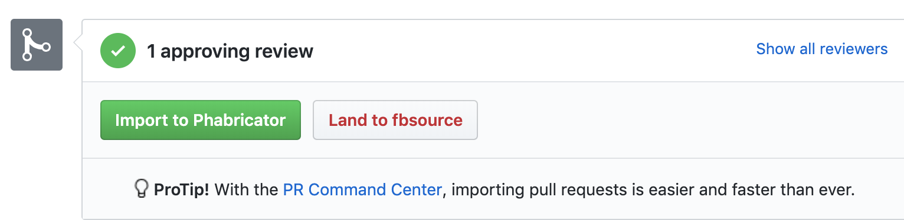

<!--
  About this guide:
  As this document is located in the React Native wiki, its audience is people looking to contribute code to the project. For non-code contributions, use the CONTRIBUTING.md document at the root of the React Native repository.
-->

Thank you for your interest in contributing to React Native! From commenting on and triaging issues, to reviewing and sending PRs, [all contributions are welcome](https://github.com/facebook/react-native/blob/master/CONTRIBUTING.md). In this document, we'll cover the steps to contributing code to React Native.

If you are eager to start contributing code right away, we have a list of [good first issues][gfi] that contain bugs which have a relatively limited scope. As you gain more experience and demonstrate a commitment to evolving React Native, you may be granted issue management permissions in the main repository.

[gfi]: https://github.com/facebook/react-native/labels/good%20first%20issue

# How to Contribute Code

Code-level contributions to React Native generally come in the form of [pull requests](https://help.github.com/en/articles/about-pull-requests). The process of proposing a change to React Native can be summarized as follows:

1. Fork the React Native repository and create your branch from `master`.
2. If you've added code that should be tested, add tests.
3. If you've changed APIs, update the documentation.
4. Ensure the test suite passes.
5. Make sure your code lints.
6. If you haven't already, complete the Contributor License Agreement ("CLA").
7. Push the changes to your fork.
8. Create a pull request to the core React Native repository.
9. Review and address comments on your pull request.

If all goes well, your pull request will be merged. If it is not merged, maintainers will do their best to explain the reason why.

If this is your first time sending a pull request, we have created a [step-by-step guide to help you get started][first-pr].

[first-pr]: https://github.com/facebook/react-native/wiki/Your-First-Pull-Request

## Pull Requests

Pull requests should be reviewed and approved using GitHub's review feature before they are considered eligible to be merged. While anyone has the ability to review and approve a pull request, we typically only consider a pull request ready to be merged when the approval comes from one of the [contributors](https://github.com/facebook/react-native/blob/master/ECOSYSTEM.md).

Reviewing a pull request can take a considerable amount of time. In some cases, the review might require more time to perform than it took someone to write and submit their changes! It's therefore necessary to do some preliminary work to ensure each pull request is in a good state to be reviewed.

### Handling Pull Requests

A pull request should consist of three main sections:

* A summary. This helps us understand the motivation behind the changes.
* A changelog. This helps us write the release notes. It also serves as a brief summary of your changes.
* A test plan. This might be the most important part of your pull request. It lets us know that you have verified the change properly, and helps us understand if you've considered any edge cases.

Any one pull request may require a deeper understanding of some area of React Native that you may not be familiar with. Even if you don't feel like you are the right person to review a pull request, you may still help by adding labels or asking the author for more information.

Consider starting with pull requests that have been flagged as lacking a changelog or test plan.

* PRs that appear to lack a changelog (https://github.com/facebook/react-native/pulls?utf8=%E2%9C%93&q=is%3Apr+is%3Aopen+label%3A%22Missing+Changelog%22+) - take a look and see if you can add the changelog yourself by editing the PR. After doing so, remove the "Missing Changelog” label.

* PRs that are missing a test plan (https://github.com/facebook/react-native/pulls?q=is%3Apr+label%3A%22Missing+Test+Plan%22+is%3Aclosed) - open the pull request and look for a test plan. If the test plan looks sufficient, remove the "Missing Test Plan” label. If there is no test plan, or it looks incomplete, add a comment politely asking the author to consider adding a test plan.

A pull request must pass all the tests before it can be merged. They run on every commit on master and pull request. A quick way to help us get pull requests ready for review is to search for pull requests that are failing the pre-commit tests (https://github.com/facebook/react-native/pulls?utf8=%E2%9C%93&q=is%3Apr+is%3Aopen+label%3A%22CLA+Signed%22+status%3Afailure+) and determine if they need to be revised. The failing test is usually listed near the bottom of the thread, under “Some checks were not successful.”

* Take a quick glance at the latest tests runs on master (https://circleci.com/gh/facebook/react-native/tree/master). Is master green? If so,
    * Does it look like the failure may be related to the changes in this pull request? Ask the author to investigate.
    * Even if master is currently green, consider the possibility that the commits in the pull requests may be based off a commit from a point in time when master was broken. If you believe this may be the case, ask the author to rebase their changes on top of master in order to pull in any fixes that may have landed after they started working on the pull request.
* If master appears to be broken, look for any issues labeled as “CI Test Failure” (https://github.com/facebook/react-native/issues?utf8=%E2%9C%93&q=is%3Aissue+is%3Aopen+label%3A%22%E2%9D%8CCI+Test+Failure%22+).
    * If you find an issue that seems related to the failure on master, go back to the pull request and thank the author for proposing these changes, and let them know that the test failure may be unrelated to their particular change (do not forget to link back to the CI Test Failure issue, as this will help the author know when they can try running tests again).
    * If you cannot find an existing CI Test Failure issue that describes the problem you've observed on master, please submit a new issue and use the “CI Test Failure” label to let others know that master is broken (see this issue (https://github.com/facebook/react-native/issues/23108) for an example).

#### Reviewing PRs

So you've found a pull request that you feel confident reviewing. Please make use of the GitHub Review feature, and clearly communicate any suggested changes politely.

<!-- To be added later: how we prioritize PRs -->

#### How does a PR get merged?

The React Native GitHub repository is actually a mirror of a subdirectory from one of Facebook's monorepos. Pull requests are therefore not merged in the traditional sense. Instead, they need to be imported into Facebook's internal code review system as a “diff” (https://www.phacility.com/phabricator/differential/). Once imported, the changes will go through a suite of tests. Some of these tests are land-blocking, meaning they need to succeed before the contents of the diff can be merged. If the diff lands successfully, the changes will eventually get synced back to GitHub by ShipIt (https://github.com/facebook/fbshipit) as a single commit.

Facebook employees can import a pull request in one of two ways: the pull request can be “landed to master”, meaning it will be imported and the resulting diff will be approved automatically, and barring any failures, the changes will eventually sync back to master. A pull request may also be “imported to fbsource”, meaning the changes will be copied to an internal diff that will require further review and approval before it can land.

<!-- END: Pull Requests -->

## Tests

Tests help us prevent regressions from being introduced to the codebase. The GitHub repository is continuously tested using Circle and Appveyor, the results of which are available through the Checks functionality on [commits](https://github.com/facebook/react-native/commits/master) and pull requests. You can learn more about running and writing tests in the [Tests wiki](/Tests.md).

<!-- END: How to Contribute Code -->
