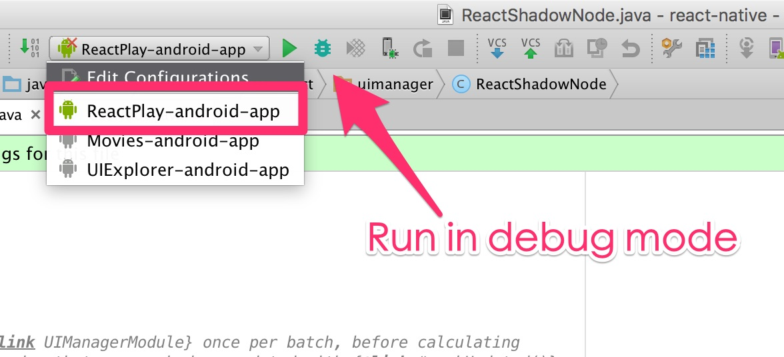

# Running ReactNative From Git Repo

`react-native init` installs react-native from npm everytime. If we are working on ReactNative itself, it'd be more efficient to run code from the repo.

Clone the repo and install npm dependencies:

```
$ git clone https://github.com/facebook/react-native.git
$ npm install
```

Now make the react-native repo available globally as npm module by using the link command:

```
$ npm link
```

You should now be able to run the `react-native-global` command:

```
$ react-native-global
Usage: react-native <command>

Commands:
  - start: starts the webserver
  - bundle: builds the javascript bundle for offline use
  - unbundle: builds javascript as "unbundle" for offline use
  - new-library: generates a native library bridge
  - link: Adds a third-party library to your project. Example: react-native link awesome-camera
  - android: generates an Android project for your app
  - run-android: builds your app and starts it on a connected Android emulator or device
  - run-ios: builds your app and starts it on iOS simulator
  - upgrade: upgrade your app's template files to the latest version; run this after updating the react-native version in your package.json and running npm install
```

## Developing JavaScript

Create an entry file to exercise the feature you are working on. You can put it anywhere.

```js
// index.js
import React from "react";

import {
  AppRegistry,
  View,
  Text,
  StyleSheet,
} from 'react-native';

function App() {
  return (
    <View style={style.container}>
      <Text>hello react native</Text>
    </View>
  );
}

const style = StyleSheet.create({
  container: {
    flex: 1,
    alignSelf: 'stretch',

    alignItems: 'center',
    justifyContent: 'center',

    backgroundColor: 'rgba(255,0,0,0.3)',
  }
});

// Having to register the app name is kinda lame.
AppRegistry.registerComponent('SampleApp', () => App);
```

Start the packager in the same directory as the entry file you are testing:

```
$ react-native-global start --root .
```

Now make changes to JavaScript files in ReactNative.

## Developing iOS

1. Open `Examples/ReactPlay/RNPlay.xcodeproj` with Xcode, and hit `cmd-r` to launch the simulator.
2. Make changes.
3. `cmd-r` to relaunch the app.
4. Debug in Xcode.

## Developing Android

Open the root directory in Android Studio, and select the `ReactPlay-android-app` target:



Make changes and Debug in Android Studio.

