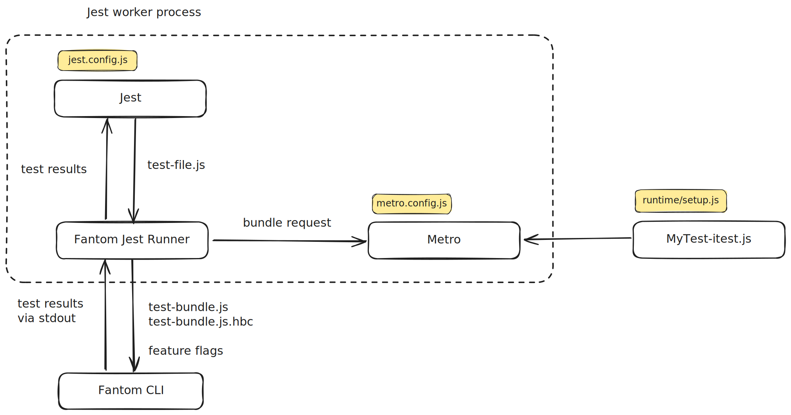

# 👻 React Native Fantom

[🏠 Home](../../../__docs__/README.md)

> [!WARNING]
>
> This is experimental!
>
> We are limiting the scope of the project to just React Native internals for
> now, so we can iterate on it quickly and keep the maintenance costs at bay.
>
> In the future, we might explore providing it for testing library/product code
> internally and externally.
>
> This means tests must live in `packages/react-native`.

Fantom is the new **integration testing and benchmarking tool for React
Native**.

Its main goal is to allow running JavaScript code as close as possible to a real
React Native application, using its cross-platform architecture (Hermes, Fabric,
C++ TurboModules, Bridgeless, etc.) in a fast headless environment that can run
on CI.

Removing the need for real devices and simulators makes this faster and more
stable than existing e2e testing solutions, while still allowing us to test the
integration between JavaScript and native without the need for mocks.

When compared against Jest, layout is calculated and can be inspected in tests:

```javascript
const root = Fantom.createRoot({viewportWidth: 200, viewportHeight: 600});
let viewElement;

Fantom.runTask(() => {
  root.render(
    <View
      ref={node => {
        viewElement = node;
      }}
      style={{width: '50%', height: '10%'}}
    />,
  );
});

// Without Fantom, getBoundingClientRect would have to be mocked.
const boundingClientRect = viewElement.getBoundingClientRect();
expect(boundingClientRect.height).toBe(60);
expect(boundingClientRect.width).toBe(100);
```

Fantom is designed to make it possible to test the integration between
JavaScript, React and React Native core - platform agnostic parts. When you are
making a change to any of these parts, you should consider writing a Fantom test
for it. It is geared towards engineers working on React Native.

With Fantom you can create scenarios close to those how a real product will
interact with React Native and observe what effects it has on a mock host
platform. It exposes fine grained controls over scheduling, making it possible
to test cases that are hard to reproduce manually.

## 🚀 Usage

Create a file with the `-itest.js` suffix anywhere you would normally create a
Jest unit test file.

The high level structure of Fantom tests is similar to Jest unit tests. However,
only a subset of Jest's Global API is currently available. For example,
`test.each` is not yet implemented in Fantom. We are working on adding more Jest
APIs. If you are blocked by the lack of a specific API, please reach out to us.

Most of the interesting APIs are available via the `@react-native/fantom`
package:

```javascript
import * as Fantom from '@react-native/fantom';

describe('My feature', () => {
  it('should do something interesting', () => {
    const root = Fantom.createRoot();

    Fantom.runTask(() => {
      root.render(/* ... */);
    });

    /* some checks */
  });
});
```

For a full API reference, please see the [inline documentation](../src/index.js)
defined for the methods in the `@react-native/fantom` [module](../src/index.js).

You can check out existing files with the `-itest.js` suffix (e.g.:
[`View-itest`](../../react-native/Libraries/Components/View/__tests__/View-itest.js))
for code examples.

Run the test using the following command from the root of the React Native
repository:

```shell
yarn fantom [optional test pattern]
```

Similar to Jest, you can also run Fantom in watch mode using `--watch`:

```shell
yarn fantom --watch [optional test pattern]
```

### Test configuration

You can configure certain aspects of the test execution using pragmas in the
docblock at the top of the file. E.g.:

```javascript
/**
 * @fantom_flags jsOnlyTestFlag:true
 * @fantom_mode opt
 */
```

Available pragmas:

- `@fantom_flags`: used to set overrides for
  [`ReactNativeFeatureFlags`](../../react-native/src/private/featureflags/__docs__/README.md).
  - Example: `@fantom_flags name:value`.
  - Multiple flags can be defined in different lines or in the same line
    separated by spaces (e.g.: `@fantom_flags name:value otherName:otherValue`).
- `@fantom_mode`: used to define the compilation mode for the bundle.
  - Example: `@fantom_mode opt`
  - Possible values:
    - `dev`: development, default for tests.
    - `opt`: optimized and using Hermes bytecode, default for benchmarks.
    - `dev-bytecode`: development but using Hermes bytecode instead of plain
      text JavaScript code.
- `@fantom_react_fb_flags`: used to set overrides for internal React flags set
  in ReactNativeInternalFeatureFlags (Meta use only)

### Debugging

To debug, run your fantom test with the flag `FANTOM_ENABLE_CPP_DEBUGGING`

```shell
FANTOM_ENABLE_CPP_DEBUGGING=1 yarn fantom [optional test pattern]
```

### FAQ

#### How is this different from Jest tests?

Fantom runs C++ part of React Native, as well as JavaScript on Hermes VM -
unlike Jest tests that run on V8. This makes it possible to test things related
to shadow nodes, layout, events, scheduling, C++ state updates to name a few.
The results of Fabric are mounted in a mock UI tree that can be asserted against
and individual mounting instructions can be inspected.

You can even test your C++ code. For example, we have
[Fantom tests for the new View Culling optimization](../../react-native/Libraries/Components/ScrollView/__tests__/ScrollView-viewCulling-itest.js),
which is written in C++.

#### How can I test logic related to &lt;ScrollView /> scrolling?

Fantom exposes the method `Fantom.scrollTo`. This method will trigger an
onScroll event and configure the shadow tree to reflect the new content offset:

```javascript
Fantom.scrollTo(scrollViewElement, {
  x: 0,
  y: 1,
});

expect(scrollViewElement.scrollTop).toBe(1);
```

#### What can be tested with Fantom?

Fantom was designed to make it possible to test integration between React and
Fabric with the Jest API that many people are familiar with. You can write code
to simulate any kind of input into React and assert what the output is from
React Native core to the host platform. Fantom controls the app's message queue,
which gives complete control over scheduling. This makes it possible to write
tests that simulate scenarios where an event interrupts React rendering in a
deterministic fashion.

Even JavaScript only code can be tested with Fantom. We are considering fully
deprecating "vanilla" Jest in favor of Fantom for all JavaScript tests in React
Native.

#### Is Fantom ready for production use cases?

Fantom is a stable and reliable testing framework that is here to stay. If
you're planning to make changes to React or React Native internals, we highly
recommend using Fantom as your go-to testing solution.

**Important Note:** While Fantom is ideal for testing React and React Native
internals, it is not currently supported for testing application-specific code
in React Native apps. We'll keep you updated on any future developments that may
change this.

#### Where can I find examples of tests?

Look for files with the `-itest.js` suffix to find existing tests. The Fantom
test for its public API ([`Fantom-itest.js`](../src/__tests__/Fantom-itest.js))
has simple examples you can learn from.

#### Are tests executed on Github CI?

Fantom tests are currently tied to Meta's infrastructure and do not run outside
of Meta's CI. We are working on migrating Fantom to Github CI. If you submit a
PR, the tests will run as part of the PR import process.

---

If you have any questions not answered here, please reach out to us.

## 📐 Design



Fantom tests are meant to be written, executed and reported as regular Jests
tests. To accomplish that, **Fantom is implemented as a Jest test runner**.

Fantom provides a [Jest configuration](../config/jest.config.js) to use
[its runner](../runner/runner.js) for any tests matching the `-itest.js` suffix
within the repository.

When Jest runs, for every file that matches that configuration, it calls into
the Fantom runner, which receives the path to the test file along with different
configuration objects.

The runner then follows these steps:

1. It creates a single "executable" JavaScript file using Metro (with this
   [configuration](../config/metro.config.js)), containing the test itself, its
   dependencies and some glue code to run the test at runtime and report its
   results. Depending on the configured "mode" for the test, the runner might
   compile that JavaScript file into Hermes bytecode.
2. It calls into the Fantom CLI passing the path to the executable JavaScript
   code (or Hermes bytecode) and the configured feature flags for the test. The
   Fantom CLI evaluates that code in the context of a React Native C++
   application and prints the results as JSON via its standard output.
3. The runner receives the output from the Fantom CLI and reports the provided
   results back to Jest in the correct format.

## 🔗 Relationship with other systems

### Part of this

- The Fantom runner, which provides the integration point with Jest.
- The Fantom CLI, which provides the execution environment for the Fantom
  JavaScript tests.
- The Fantom benchmarking system, which is just a library and some automatic
  configuration on top of Fantom.

### Used by this

- Metro, to compile the test code into a single file consumable by the Fantom
  CLI.
- Hermes Compiler, to compile the JavaScript test code into Hermes bytecode.
- The
  [React Native Feature Flags](../../react-native/src/private/featureflags/__docs__/README.md)
  system, via the `@fantom_flags` pragmas defined in the docblock for test
  files.
