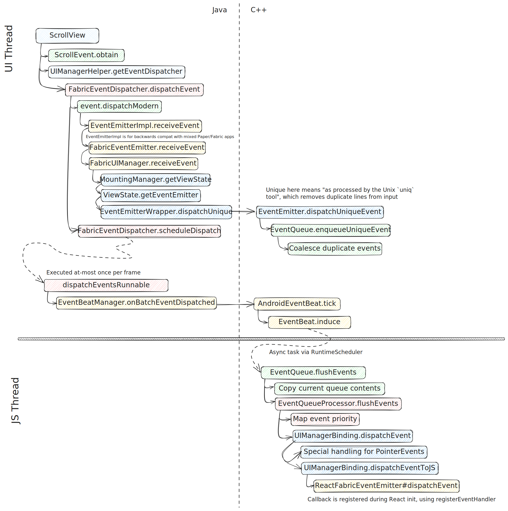

# Android event dispatching

[🏠 Home](../../../../../../../../../../../../__docs__/README.md)

This directory contains Kotlin classes specific to Android event dispatching in
the new architecture.

## Design

## Relationship with other systems

### Part of

- Android's Fabric implementation

### Used by this

This component is tightly coupled with the legacy event dispatch mechanism. Some
of the interfaces and components live in the com.facebook.react.uimanager.events
package so that they may reference internal API's.
