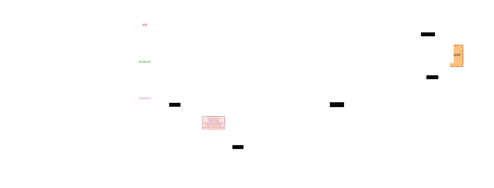

# Shared Animation Backend

[🏠 Home](../../../../../../../__docs__/README.md)

Shared Animation Backend is a part of the React Native renderer that enables
animation frameworks to update props of React components without going through
React's JavaScript rendering pipeline.

Animation Backend allows for updates of both layout and non-layout props. If
there are no layout updates, the animations will go through the
`synchronouslyUpdateProps` path, otherwise a Fabric commit will be performed. To
synchronize the changes with React, we use the `AnimationBackendCommitHook`.

## 🚀 Usage

The backend is not meant to be used directly. Its main purpose is to serve as a
layer over the Fabric renderer that animation frameworks (like Animated or
Reanimated) can use. A framework that wants to make use of the backend has to
register a callback with the `start` method. The callback will be executed on
each animation frame (supported by native mechanisms like
DisplayLink/Choreographer) and should return a list of prop updates that should
be applied for the given timestamp. To stop receiving callbacks the framework
should call `stop` with the appropriate callbackID. For updates that need to be
applied synchronously (e.g. gesture events), one can use the `trigger` method.

## 📐 Design

The main purpose of the Animation Backend is to bring long-term stability to
animation solutions. The New Architecture was designed to maintain React props
in check with the `ShadowTree`. This poses a problem for any scenario when we
want to apply updates to the `ShadowTree` without going through the React
rendering pipeline, which is exactly what animations want to do. Any commit that
happens outside of React on a different thread will be overwritten by following
React updates, as the new `ShadowTree` revision created by React is based on the
revision that is currently held by React. To mitigate that issue, we use the
`AnimationBackendCommitHook` that runs on every React commit and fixes
overridden props. In this section, we give a more detailed description of the
components that make up the Shared Animation Backend.

### AnimationBackend

This is the heart of the backend. This component is responsible for managing
user-provided callbacks, segregating props, and applying them either through the
`synchronouslyUpdateProps` path (when there are no layout updates), or through a
Fabric commit performed on the main thread. This component is exposed through
`UIManager` with the `UIManagerAnimationBackend` interface.

### AnimatedProps

This is the structure that should be returned by the callback registered with
the `start` method. It represents updates that are to be applied for a single
component identified by `ShadowNodeFamily` in `AnimationMutation`. You shouldn't
interact with this class directly, it's better to use it through the
`PropsBuilder`. `AnimatedProps` support the `RawProps` format, but they also can
hold a vector of `AnimatedProp` (a new C++ structure) for a select subset of the
usual `ViewProps`. These can be applied to the cloned props in a more efficient
way.

### AnimationBackendCommitHook

This component is responsible for keeping animation updates synchronized with
React updates. In Fabric, when React performs a commit, it disregards the
currently mounted revision of the `ShadowTree`. Instead, it bases the new
revision on the `ShadowNodes` it holds. These nodes do not represent any prop
updates that happened when the Animation Backend made a commit on the main
thread (or applied non-layout props through the fast-path). This would create an
issue where a rerender that happens during the animation would display a wrong
state for a split second. To fix this, we also write animation updates to
`AnimatedPropsRegistry`. When React performs a commit, the
`AnimationBackendCommitHook` is able to overwrite any stale props by using the
value from the registry. Since the commit hook runs on React commits, it is safe
for it to use RSNRU to propagate these updates to React. After the commit hook
runs, we clear the registry. If the prop is not explicitly changed by the user
in a render, it will remain unchanged by React on subsequent rerenders.

Additionally, in the callback registered in `start`, one can return a list of
surfaces that should perform a commit on the JS thread, to have the RSNRU
propagate the updates to React. This was used by Animated before the backend was
created.

### AnimationChoreographer

This is an abstraction layer that wraps the native frame callback mechanisms. On
iOS, it has a corresponding `RCTDisplayLink`, and on Android, it uses the
`Choreographer`. For any new platform that wants to adopt the Animation Backend,
this is the part that needs to be implemented.
