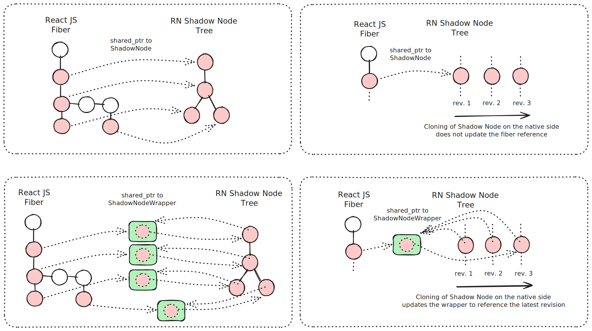

# Runtime Shadow Node Reference Updates

[🏠 Home](../../../../../../../__docs__/README.md)

RSNRU (short for Runtime Shadow Node Reference Updates) is an update mechanism
for Shadow Node references held by the React renderer. The feature guarantees
that the React renderer holds onto the latest revision of the Shadow Node after
it was cloned internally behind the React renderer's back.

This feature improves layout performance by maximizing the use of the layout
cache stored on the Shadow Node instances. Maintaining a reference to the latest
revision of Shadow Node instances cloned internally after a commit also improves
the freshness of native state held on the Shadow Node instance.

## 🚀 Usage

RSNRU is enabled by default in single threaded mode. The JS Runtime thread is
marked as the thread allowing Shadow Node refernce updates to happen.

Threads can be marked for allowing RSNRU by calling the ShadowNode's
`setUseRuntimeShadowNodeReferenceUpdateOnThread` function from the thread.

If the `updateRuntimeShadowNodeReferencesOnCommit` feature flag is enabled,
RSNRU will run on commit and propagate internal clones from any thread, ignoring
the `setUseRuntimeShadowNodeReferenceUpdateOnThread` setting.

## 📐 Design

The React renderer running within the JS Runtime communicates with React Native
through operations running on pointers to ShadowNode instances created by React
Native. The renderer will submit requests for creating, mutating and cloning
ShadowNode instances. These operations take ShadowNode pointers as input (for
creation and mutation) and returns the resulting ShadowNode as a pointers to the
ShadowNode instance. Any operation requested by the renderer does not trigger
RSNRU since the renderer receives the cloned instance as a result for the call
to React Native.

RSNRU modifies the returned response by returning a wrapper around the
ShadowNode pointer and storing a reference to this wrapper on the ShadowNode
instance. This mechanism enables React Native to update the wrapper to point to
new clone of the ShadowNode without needing to call into the JS Runtime.

When the renderer commits a rendered tree, React Native will process the commit
by running state updates and the layout of the tree of ShadowNode instance.
Because ShadowNode instance are immutable, any change resulting from these
operations will lead to the ShadowNode being cloned so that the mutation can be
applied to the cloned instance.

Whenever ShadowNode cloning happens outside of a direct renderer request, RSNRU
will check if the ShadowNode is referenced by the renderer within the JS Runtime
by checking if the ShadowNode instance holds a reference to a wrapper. If a
wrapper is present, it will be updated with the newly cloned instance so that
the renderer would hold a reference to that new revision of the ShadowNode
instance.

When the renderer commits the next renderer tree, React Native will interact
with ShadowNode instances that hold the native state and layout information
evaluated during the last commit. This improves the "freshness" of the
ShadowNode layout cache and improves the layout pass.
