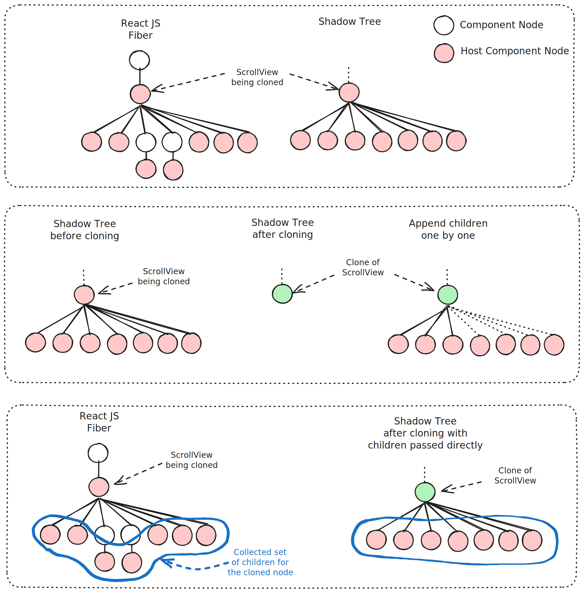

# Runtime Shadow Node Reference Updates

[🏠 Home](../../../../../../../__docs__/README.md)

The `passChildrenWhenCloningPersistedNodes` feature improves rendering
performance for use cases where cloning of Shadow Nodes holding a large number
of children is frequent. A typical example of these are ScrollView components
holding large lists. The feature improves layout performance by reducing the
need to invalidate the layout information held by the cloned Shadow Node.

## 🚀 Usage

The features is controlled by the `passChildrenWhenCloningPersistedNodes` flag
defined in the `ReactNativeInternalFeatureFlags` file. Seeting the feature flag
before the React renderer is initialized will enable the feature.

## 📐 Design

When the React renderer needs to clone a node that represents a host component
and thus has a corresponding ShadowNode instance, the process follows these
steps:

- Clone the ShadowNode
- Traverse the node's descendants to find all first level host components
- Whenever a host component is seen, append it to the newly cloned ShadowNode
  instance

Most ShadowNode instances hold layout data and are represented by a
YogaLayoutableShadowNode. These nodes are responsible for keeping the yoga tree
updated and holding the final layout data for the native view that the
ShadowNode represents.

Any modification of a YogaLayoutableShadowNode will mark the node as dirty and
requiring layout when committed. Appending a child node to a
YogaLayoutableShadowNode is considered as a modification. Meaning that whenever
the React renderer needs to clone a ShadowNode that has direct children, it will
be marked as having a dirty layout when the children will be appended back to
the cloned instance.

The `passChildrenWhenCloningPersistedNodes` feature collects all children that
need to be appended to the ShadowNode after cloning in a set. This set is being
passed to the ShadowNode clone call which in turn will append back the nodes
directly during the cloning. This removes the need to append the children one by
one after cloning and bypasses the node dirtying that is involved with this type
of mutation.

The clone implementation of the YogaLayoutableShadowNode will compare the
previous set of children with the new set. If both sets have the same size and
each node has equivalent styling, the cloned node is not being dirtied for
layout. This allows for improving the layout data re-use on subsequent renders.
