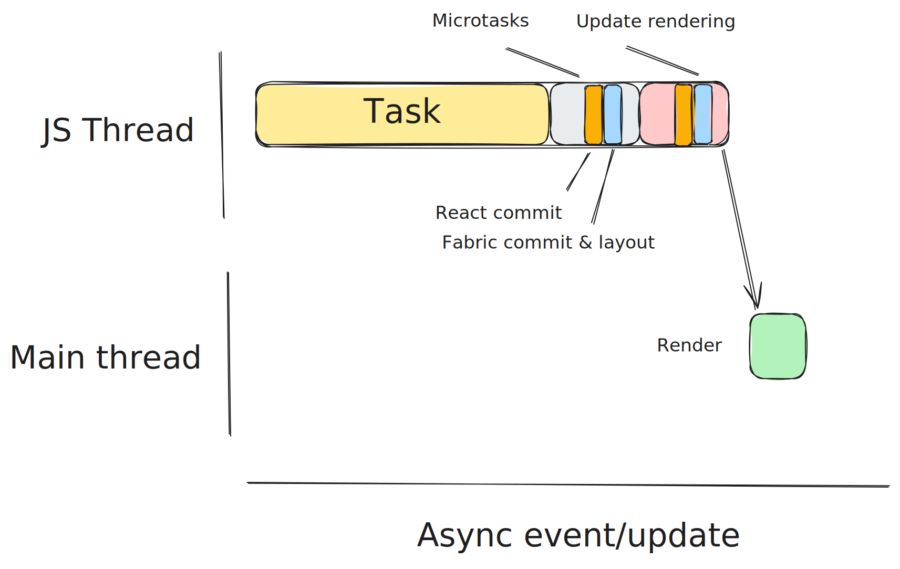
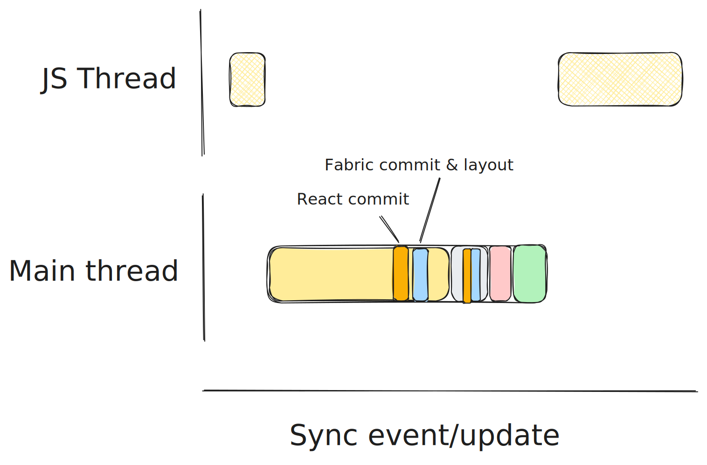

# Event Loop

[🏠 Home](../../../../../../../__docs__/README.md)

The Event Loop is the formalization of the execution model for JavaScript in
React Native, and how that model synchronizes with rendering work in the host
platform.

Its main goals are:

- To make the behavior of the framework more predictable, to help developers
  build more reliable and performant apps.
- To increase the alignment with Web specifications, to simplify the adoption of
  Web APIs in React Native.
- (Secondary) Provide a solid foundation for general performance optimizations
  relying on better scheduling or sequencing.

The implementation of the event loop in React Native is aligned with
[its definition in the HTML specification](https://html.spec.whatwg.org/multipage/webappapis.html#event-loop-processing-model).
React Native only implements a subset of it, in order to support its existing
semantics and APIs.

> [!NOTE]
>
> The Event Loop in React Native was originally proposed in this
> [RFC](https://github.com/react-native-community/discussions-and-proposals/blob/main/proposals/0744-well-defined-event-loop.md),
> which contains additional context (e.g.: how this was introduced and what
> React Native had before).

## Usage

The event loop is an implementation detail so it is not used directly, but
several APIs integrate deeply with it:

- State updates processed by React are scheduled to be flushed (rendered in the
  host platform) at the end of the current event loop tick.
- Promises, `queueMicrotask` and APIs like `MutationObserver` add microtasks to
  the microtask queue, processed as part of the current event loop tick.
- Timers and APIs like `requestIdleCallback` schedule tasks to be processed by
  the event loop. In the case of `requestIdleCallback`, the tasks are scheduled
  with specific priorities.
- `PerformanceObserver` entries like `longtask` and `event` provide timing
  information about different parts of the event loop.

One of the most important semantics of the event loop is the **atomicity of UI
updates in tasks**. All changes to the UI triggered from JavaScript in a task
(processing state updates in React, dispatching view commands, etc.) are always
flushed together to the host platform, so the UI is never updated with partial
work done within a task. For example:

1. We dispatch an event to JavaScript and execute one or more event handlers.
2. Those event handlers do one or more state updates in React. React schedules a
   microtask to process them.
3. In a microtask, React processes all those state updates together,
   re-rendering the necessary components and committing at the end.
4. As part of the commit, we might execute layout effects that might trigger
   more state updates. Those state updates are processed synchronously at the
   end of the commit.
5. At the end of the current microtask, we execute the rest of the microtasks.
6. When the microtask queue is empty, we flush all changes to the host platform.

In code, that could look like this:

```javascript
function App(props) {
  const [showContent, setShowContent] = useState(false);

  return (
    <>
      <Header
        onPressButton={event => {
          // A task executes all the event handlers.
          // The state update is processed in a microtask.
          setShowContent(true);
        }}
      />
      {showContent ? <Content /> : null}
    </>
  );
}

function Content(props) {
  const [width, setWidth] = useState(0);

  // Executed synchronously as part of the commit phase, in the microtask.
  useLayoutEffect(() => {
    // This state update is processed synchronously in the same microtask.
    // UI updates are still not flushed to the host platform until the end
    // of the event loop tick, so the user never saw this changed widths.
    setWidth(ref.getBoundingClientRect().width);
  }, []);

  return (
    <>
      <SomeView ref={ref} />
      <OtherComponent width={width} />
    </>
  );
}
```

## Design

The conceptual model is **aligned with
[the model on the Web](https://html.spec.whatwg.org/multipage/webappapis.html#event-loop-processing-model)**
(from which it borrows some concepts and steps), while **still benefiting from
the React Native threading model**.

The event loop continuously goes through these steps (in what we refer to as an
"event loop tick"):

1. Select the next task to execute among all tasks waiting for execution.
2. Execute the selected task.
3. Execute **all** scheduled microtasks.
4. Update the rendering.



One of the key benefits of this model is that each **event loop iteration
represents an atomic UI update**. This helps reason about whether work scheduled
within a specific task should be rendered together or not. If it is a step in
the same task, scheduled as a microtask or one of the specific sub-steps in
updating the rendering, then it will be atomic. Otherwise, if it was scheduled
as a separate task (e.g.: using timers, native callbacks, etc.) it would
constitute a separate UI update.

### Detailed steps

#### 1. Task selection

On the Web, task selection is an implementation detail left to browsers to
decide.

In React Native, we rely on `RuntimeScheduler` for task selection, which already
supports the execution of tasks with priorities. The criteria it uses is:

1. If there are expired tasks, select expired tasks in the order in which they
   expired.
2. Otherwise, select tasks by priority, in the order in which they were
   scheduled.

The Web specification defines the concept of task queues as a mechanism to
ensure that certain types of tasks execute in a specific order (e.g.: events).
React Native has the concept of event queue that serve the same purpose.

#### 2. Task execution

Task execution is calling the JavaScript function or C++ callback that is
associated to the task that was scheduled.

#### 3. Microtask execution

In this step we drain the microtask queue, executing all the microtasks in
order. A microtask can schedule additional microtasks, so incorrect product
logic could lead to an infinite loop. This is expected and it is the same
behavior as on the Web.

#### 4. Update the rendering

The last step is to check if the previous work produced any rendering updates
(transactions produced by commits in React, or view commands being dispatched).
If that is the case, it notifies the host platform that it should apply the
necessary mutations to reach that state.

In the future, this step could be extended to do more of the work that browsers
do. For example, it could run resize observations and run resize observer
callbacks, or update animations and run animation frame callbacks.

### Synchronous execution, events and rendering

The formalization of the event loop also allows the efficient implementation of
synchronous events. Because the event loop defines the tick as an atomic unit of
work that leads to a full UI update, we can also use it as the unit of work to
be executed in the UI thread.



### Implementation

Most of the implementation of the event loop is done in the
[`RuntimeScheduler`](../RuntimeScheduler.h) class (specifically in
[`RuntimeScheduler_modern`](../RuntimeScheduler_Modern.h), which is the version
used in the new architecture).

That class implements both the task scheduler that handles priorities and the
processing of those tasks within the event loop.

## Relationship with other systems

### Part of this

- The implementation of
  [`queueMicrotask`](../../../nativemodule/microtasks/__docs__/README.md) to
  schedule microtasks in the event loop.

### Used by this

- React timing primitives, to do time measurements of the execution of certain
  parts of the event loop to integrate with `PerformanceObserver`.
- Indirectly, it reports long tasks and event timing to `PerformanceObserver`.
- It also integrates with the React Native DevTools tracing infrastructure to
  report the timing of tasks.

### Uses this

- [MutationObserver](../../../../../src/private/webapis/mutationobserver/__docs__/README.md)
  uses the event loop to schedule mutation observer callbacks as microtasks.
- `Scheduler` integrates with the event loop to register reporters (for
  `PerformanceObserver`) and schedules the specific work to be done as part of
  the rendering updates.
