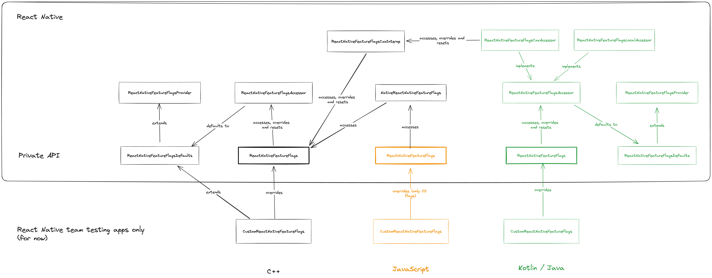

# Feature Flags

Feature flags are values that determine the behavior of specific parts of React
Native. This directory contains the configuration for those values, and scripts
to generate files for different languages to access and customize them.

There are 2 types of feature flags:
* Common: can be accessed from any language and they provide consistent values
everywhere.
* JS-only: they can only be accessed and customized from JavaScript.

## Definition

The source of truth for the definition of the flags is the file
`ReactNativeFeatureFlags.config.js` in this directory.

Example contents:
```javascript
module.exports = {
  common: {
    enableMicrotasks: {
      description: 'Enable the use of microtasks in the JS runtime.',
      defaultValue: false
    }
  },
  jsOnly: {
    enableAccessToHostTreeInFabric: {
      description: 'Enables access to the host tree in Fabric using DOM-compatible APIs.',
      defaultValue: false
    }
  }
};
```

**After any change to these definitions**, the code that provides access to them
must be regenerated running this from the `react-native`
repository:

```shell
yarn featureflags-update
```

## Access

You can access the common feature flags from anywhere in your application using
the `ReactNativeFeatureFlags` interface (available in C++/Objective-C++,
Kotlin/Java and JavaScript). JS-only feature flags can only be accessed from
JavaScript.

**Accessing feature flags should be considered fast for all use cases**.
Feature flags are cached at every layer, which prevents having to go through JNI
when accessing the values from Kotlin and through JSI when accessing the values
from JavaScript.

### C++ / Objective-C

```c++
#include <react/featureflags/ReactNativeFeatureFlags.h>

if (ReactNativeFeatureFlags::enableMicrotasks()) {
  // do something
}
```

### Kotlin

```kotlin
import com.facebook.react.internal.featureflags.ReactNativeFeatureFlags

fun someMethod() {
  if (ReactNativeFeatureFlags.enableMicrotasks()) {
    // do something
  }
}
```

### JavaScript

```javascript
import * as ReactNativeFeatureFlags from 'react-native/src/private/featureflags/ReactNativeFeatureFlags';

if (ReactNativeFeatureFlags.enableMicrotasks()) {
  // Native flag
}

if (ReactNativeFeatureFlags.enableAccessToHostTreeInFabric()) {
  // JS-only flag
}
```

## Customization

Feature flags provide the default values defined in the configuration unless
overrides are applied at the application level. Overrides for common feature
flags can only be defined in native, while overrides for JS-ony flags can only
be defined in JavaScript.

Overrides must be applied before any of the available feature flags has been
accessed. This prevents having inconsistent behavior during the lifecycle of the
application.

### C++/Objective-C

```c++
#include <react/featureflags/ReactNativeFeatureFlags.h>
#include <react/featureflags/ReactNativeFeatureFlagsDefaults.h>

class CustomReactNativeFeatureFlags : public ReactNativeFeatureFlagsDefaults {
 public:
  CustomReactNativeFeatureFlags();

  bool enableMicrotasks() override {
    return true;
  }
}

ReactNativeFeatureFlags::override(std::make_unique<CustomReactNativeFeatureFlags>());
```

### Kotlin

```kotlin
import com.facebook.react.internal.featureflags.ReactNativeFeatureFlags
import com.facebook.react.internal.featureflags.ReactNativeFeatureFlagsDefaults

fun overrideFeatureFlags() {
  ReactNativeFeatureFlags.override(object : ReactNativeFeatureFlagsDefaults() {
    override fun useMicrotasks(): Boolean = true
  })
}
```

### JavaScript

```javascript
import * as ReactNativeFeatureFlags from 'react-native/src/private/featureflags/ReactNativeFeatureFlags';

ReactNativeFeatureFlags.override({
  enableAccessToHostTreeInFabric: () => true,
});
```

## Architecture

The architecture of this feature flags system can be described as follows:
* A shared C++ core, where we provide access to the flags and allow
customizations.
* A Kotlin/Java interface that allows accessing and customizing the values in
the C++ core (via JNI).
* A JavaScript interface that allows accessing the common values (via a native
module) and accessing and customizing the JS-only values.



_This image has an embedded [Excalidraw](https://www.excalidraw.com) diagram,
so you can upload it there if you need to make further modifications._
