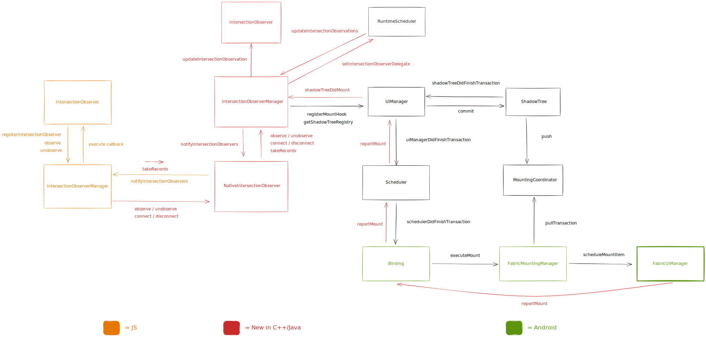

# IntersectionObserver

[🏠 Home](../../../../../../../__docs__/README.md)

This directory contains the React Native implementation of the
[IntersectionObserver API](https://developer.mozilla.org/en-US/docs/Web/API/IntersectionObserver).

## Usage

`IntersectionObserver` is meant to be used from JavaScript, exposed as a global
class.

## Design

This is the high-level design of the IntersectionObserver API:

The global `IntersectionObserver` class is defined in JavaScript and it does its
setup using a native module.

In native, it uses mount hooks from `UIManager` to run intersection calculations
and update the state of the observers. When a mount operation is reported from
the host platform to `UIManager`, `UIManager` notifies the mount hook that
triggers a check on the observers that are observing intersections on that
surface. If the intersection triggers a state change, the notification is
dispatched to the JavaScript observers.

For the initial intersection notification (which is meant to report the state at
the time of observation), this system checks if there are pending transactions
for the given surface. If there are, we just wait for the transaction to be
mounted and use the mount hook to report the initial notification. If there
aren't, we dispatch the notification immediately.

## Relationship with other systems

### Part of this

- [NativeIntersectionObserver C++ TurboModule](../../../../../ReactCommon/react/nativemodule/intersectionobserver/__docs__/README.md).
- [C++ implementation](../../../../../ReactCommon/react/renderer/observers/intersection/__docs__/README.md).

### Used by this

- This relies on mount hooks provided by `UIManager`, and on the information
  provided by the shadow tree registry provided by `UIManager` as well.
- It uses the C++ TurboModule infra for communication between JavaScript and
  native.

### Uses this

- This is an API meant to be used by end users. It is not used directly but any
  other parts of the platform.
