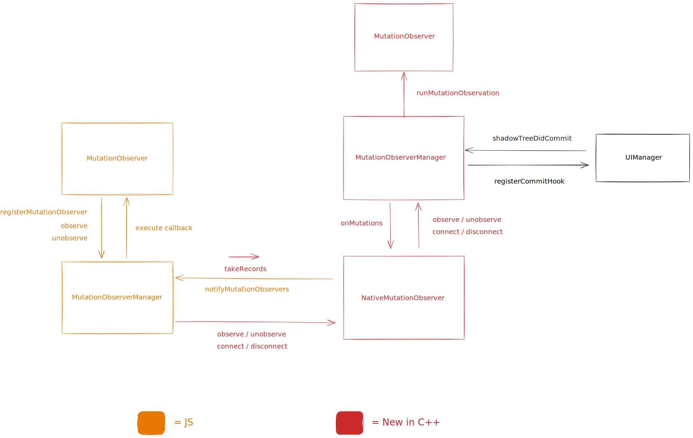

# MutationObserver

[🏠 Home](../../../../../../../__docs__/README.md)

This directory contains the React Native implementation of the
[MutationObserver API](https://developer.mozilla.org/en-US/docs/Web/API/MutationObserver).

## 🚀 Usage

`MutationObserver` is meant to be used from JavaScript, exposed as a global
class.

## 📐 Design

This is the high-level design of the MutationObserver API:

The global `MutationObserver` class is defined in JavaScript and it does its
setup using a native module.

In native, it relies on ShadowTree commit hooks to get notifications about
changes in the tree, and detects mutations using the before/after revisions. It
relies on referential equality of the shadow nodes for performance
optimizations.

## 🔗 Relationship with other systems

### Part of this

- [NativeMutationObserver C++ TurboModule](../../../../../ReactCommon/react/nativemodule/mutationobserver/__docs__/README.md).
- [C++ implementation](../../../../../ReactCommon/react/renderer/observers/mutation/__docs__/README.md).

### Used by this

- This relies on `ShadowTree` commit hooks provided by `UIManager`.
- It uses the C++ TurboModule infra for communication between JavaScript and
  native.
- It uses the
  [`Event Loop`](../../../../../ReactCommon/react/renderer/runtimescheduler/__docs__/README.md)
  to schedule mutation observer callbacks as microtasks.

### Uses this

- This is an API meant to be used by end users. It is not used directly but any
  other parts of the platform.
